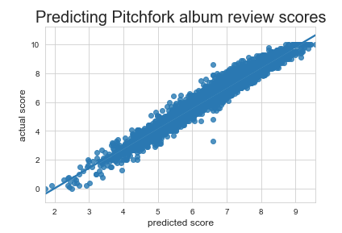
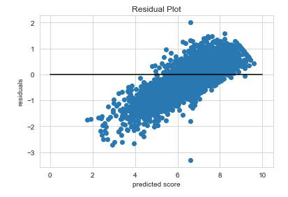
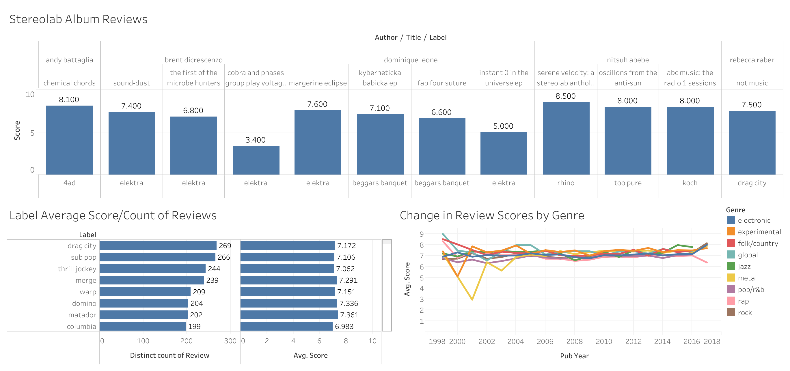

After pre-processing and cleaning ~18,000 Pitchfork album reviews, I merged the cleaned review text into a dataframe along with other relevant album data that the dataset came with. I tried topic modeling two ways: TF-IDF Vectorizer with NMF and Count Vectorizer with LDA -- TF-IDF/NMF gave me the clearer, more interpretable topics. I collected a total of 10 topics; the topics I got addressed music genres, type of album release, sentiments and emotions, and specific artists or bands that were reviewed a significant # of times. The more I refined my stopwords and re-ran my vectorizer, the clearer my topics became. 

After I felt that I got cohesive enough topics, I tried using the topics as features in a regressive model to predict album review score. Only using the 10 topics, I got a relatively high r-squared score of 0.87 with a rmse of 0.47 using Random Forest. Running Elastic Net gave me a slightly lower score. Additionally, I incorporated a few more features including album release date, review release date, and dummified genre columns for a small boost in r-squared and lowered error metric. Looking at my plots, it seems that my model has the hardest time predicting albums that were scored between 6.0 and 7.0.

I also did some topic modeling on just Rock genre reviews to see if I was able to draw out more nuanced topics. When running TF-IDF/NMF on Rock reviews, the topics seemed to be compromised of sub-genres of rock. I ran a Random Forest regressor on this dataset and got similar scores. 

I would like to compare topics and common parts of speech for positive vs negative reviews to draw out more analysis in my text. I quantify positive reviews as receiving a score of 8.0 or higher and negative reviews as scores of 6.0 or lower. In addition, I would like to run Corex for topic modeling. Time allowing, I would like to build a recommendation system that recommends albums based on a user's input of adjectives and nouns describing the type of music they are interested in. 

Here's a fun Tableau dashboard I made exploring the dataset: 

